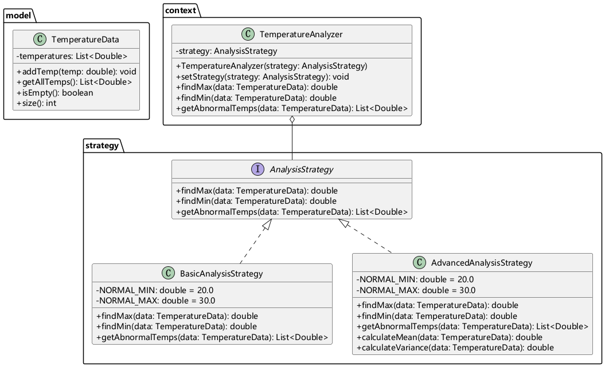
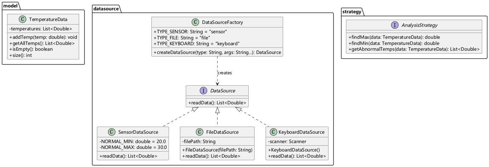
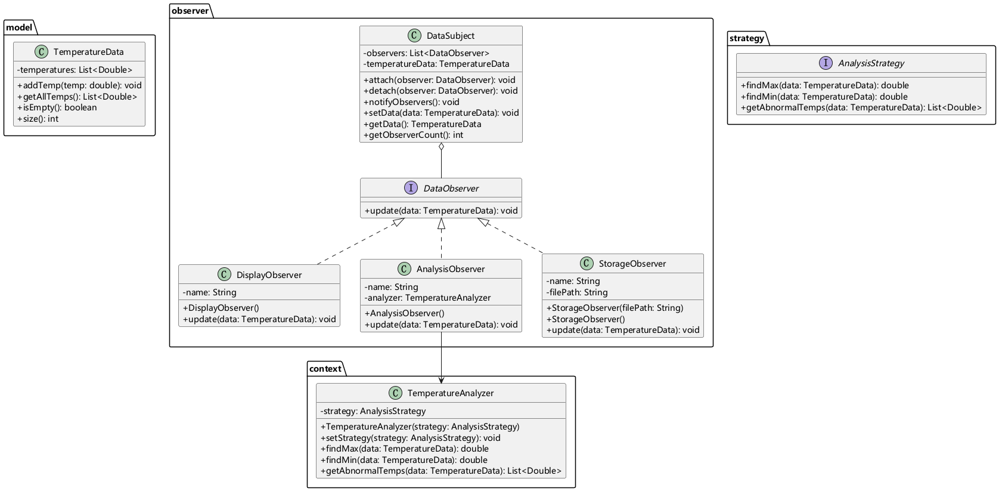

# 软件设计模式与重构 - 课程作业文档

## 目录

1. [课堂笔记](#课堂笔记)
2. [练习题内容](#练习题内容)
3. [方案设计](#方案设计)
4. [类图](#类图)
5. [代码实现](#代码实现)
6. [运行结果与分析](#运行结果与分析)

---

## 课堂笔记

### 面向对象五个核心特征

| 特征 | 说明                                             |
| ---- | ------------------------------------------------ |
| 封装 | 将数据和对数据的操作封装在类中，隐藏内部实现细节 |
| 抽象 | 通过类或接口抽象出事物的本质特征                 |
| 继承 | 子类继承父类的属性和方法，实现代码复用           |
| 多态 | 同一个方法调用产生不同的行为效果                 |
| 组合 | 将一个类的对象作为另一个类的成员变量             |

### 设计原则

#### 开闭原则 (Open-Closed Principle)

> 软件实体应该对扩展开放，对修改关闭。

**核心思想**：

- 使用抽象进行封装，定义稳定的接口
- 允许通过扩展来改变行为，而不是修改现有代码

#### 针对抽象编程 (Programming to an Interface)

> 依赖抽象，不要依赖具体类。

**核心思想**：

- 变量、参数、返回值使用接口或抽象类型
- 避免直接依赖具体实现类

### 设计模式

#### 策略模式 (Strategy Pattern)

**定义**：定义一系列算法，把它们一个个封装起来，并且使它们可相互替换。

**结构**：

```
Context (上下文) ----> Strategy (策略接口)
                         ↑
                   ConcreteStrategy (具体策略)
```

**优点**：

- 算法可自由切换
- 避免使用多重条件判断
- 扩展性好，符合开闭原则

#### 工厂模式 (Factory Pattern)

**定义**：定义一个创建对象的接口，让子类决定实例化哪一个类。

**结构**：

```
Factory ----> Product (产品接口)
                  ↑
            ConcreteProduct (具体产品)
```

**优点**：

- 解耦对象的创建和使用
- 添加新产品只需添加新的具体产品类，无需修改工厂

#### 观察者模式 (Observer Pattern)

**定义**：定义对象间的一种一对多的依赖关系，当一个对象状态改变时，所有依赖它的对象都会收到通知。

**结构**：

```
Subject (被观察者) ----> Observer (观察者接口)
                              ↑
                        ConcreteObserver (具体观察者)
```

**优点**：

- 降低对象之间的耦合度
- 支持广播通信
- 符合开闭原则，新增观察者无需修改被观察者

---

## 练习题内容

### 练习1：温度数据分析系统

**需求**：采集设备温度原始数据并进行分析，排查异常、定位故障。

**温度判定标准**：

- 正常工作温度区间：20~30℃
- 异常低温：< 20℃（可能是传感器接触不良）
- 异常高温：> 30℃（可能是散热故障）

**数据示例**：`[25.1, 24.8, 26.3, 5.2, 27.2, 32.5, 24.5]`

### 练习2：多数据源采集系统

**需求扩展**：数据来源途径变化，支持多种数据源。

**数据来源**：
| 数据源 | 说明 |
|--------|------|
| 传感器 | 模拟传感器自动生成温度数据 |
| 文件 | 从磁盘文件读取温度数据 |
| 键盘 | 人工键盘录入温度数据 |

### 练习3：观察者模式应用

**需求扩展**：接收到数据后，需要通知不同的模块，对数据进行显示、分析、存储等操作与更新。

**观察者模块**：
| 模块 | 职责 |
|------|------|
| 显示模块 | 展示原始数据 |
| 分析模块 | 异常识别、排序、统计分析 |
| 存储模块 | 保存数据到文件 |

---

## 方案设计

### 整体架构

```
┌─────────────────────────────────────────────────────────────┐
│                        App (主程序)                          │
└─────────────────────────────────────────────────────────────┘
                              │
                              ▼
┌─────────────────────────────────────────────────────────────┐
│                   DataSourceFactory (工厂)                    │
│  ┌──────────┐  ┌──────────┐  ┌──────────┐                │
│  │ 传感器   │  │   文件   │  │   键盘   │                │
│  └──────────┘  └──────────┘  └──────────┘                │
└─────────────────────────────────────────────────────────────┘
                              │
                              ▼
┌─────────────────────────────────────────────────────────────┐
│              DataSubject (被观察者/数据主题)                  │
└─────────────────────────────────────────────────────────────┘
                              │
          ┌──────────────────┼──────────────────┐
          ▼                  ▼                  ▼
┌─────────────────┐ ┌─────────────────┐ ┌─────────────────┐
│ DisplayObserver │ │AnalysisObserver │ │StorageObserver │
│   (显示模块)    │ │   (分析模块)    │ │   (存储模块)    │
└─────────────────┘ └─────────────────┘ └─────────────────┘
```

### 设计模式应用

| 练习  | 设计模式   | 应用场景                           |
| ----- | ---------- | ---------------------------------- |
| 练习1 | 策略模式   | 不同分析策略（基础分析/高级分析）  |
| 练习2 | 工厂模式   | 不同数据源创建（传感器/文件/键盘） |
| 练习3 | 观察者模式 | 数据变化触发多模块自动处理         |

### 扩展性设计

- **新增数据源**：只需实现 `DataSource` 接口，添加到 `DataSourceFactory`
- **新增观察者**：只需实现 `DataObserver` 接口，通过 `DataSubject.attach()` 注册
- **新增分析策略**：只需实现 `AnalysisStrategy` 接口

---

## 类图

### 练习1：策略模式类图



### 练习2：工厂模式类图



### 练习3：观察者模式类图



---

## 代码实现

### 练习1：核心代码

#### TemperatureData.java

```java
package com.designpatterns.model;

import java.util.ArrayList;
import java.util.List;

public class TemperatureData {
    private List<Double> temperatures;

    public TemperatureData() {
        this.temperatures = new ArrayList<>();
    }

    public void addTemp(double temp) {
        temperatures.add(temp);
    }

    public List<Double> getAllTemps() {
        return new ArrayList<>(temperatures);
    }

    public boolean isEmpty() {
        return temperatures.isEmpty();
    }

    public int size() {
        return temperatures.size();
    }
}
```

#### AnalysisStrategy.java (策略接口)

```java
package com.designpatterns.strategy;

import com.designpatterns.model.TemperatureData;
import java.util.List;

public interface AnalysisStrategy {
    double findMax(TemperatureData data);
    double findMin(TemperatureData data);
    List<Double> getAbnormalTemps(TemperatureData data);
}
```

#### BasicAnalysisStrategy.java (基础策略)

```java
package com.designpatterns.strategy;

import com.designpatterns.model.TemperatureData;
import java.util.ArrayList;
import java.util.List;

public class BasicAnalysisStrategy implements AnalysisStrategy {
    private static final double NORMAL_MIN = 20.0;
    private static final double NORMAL_MAX = 30.0;

    @Override
    public double findMax(TemperatureData data) {
        return data.getAllTemps().stream()
            .mapToDouble(Double::doubleValue)
            .max()
            .orElse(Double.NaN);
    }

    @Override
    public double findMin(TemperatureData data) {
        return data.getAllTemps().stream()
            .mapToDouble(Double::doubleValue)
            .min()
            .orElse(Double.NaN);
    }

    @Override
    public List<Double> getAbnormalTemps(TemperatureData data) {
        List<Double> abnormal = new ArrayList<>();
        for (double temp : data.getAllTemps()) {
            if (temp < NORMAL_MIN || temp > NORMAL_MAX) {
                abnormal.add(temp);
            }
        }
        return abnormal;
    }
}
```

### 练习2：核心代码

#### DataSource.java (数据源接口)

```java
package com.designpatterns.datasource;

import java.util.List;

public interface DataSource {
    List<Double> readData();
}
```

#### DataSourceFactory.java (工厂类)

```java
package com.designpatterns.datasource;

public class DataSourceFactory {
    public static final String TYPE_SENSOR = "sensor";
    public static final String TYPE_FILE = "file";
    public static final String TYPE_KEYBOARD = "keyboard";

    public static DataSource createDataSource(String type, String... args) {
        return switch (type.toLowerCase()) {
            case TYPE_SENSOR -> new SensorDataSource();
            case TYPE_FILE -> {
                if (args.length == 0) {
                    throw new IllegalArgumentException("FileDataSource 需要文件路径参数");
                }
                yield new FileDataSource(args[0]);
            }
            case TYPE_KEYBOARD -> new KeyboardDataSource();
            default -> throw new IllegalArgumentException("未知的数据源类型: " + type);
        };
    }
}
```

### 练习3：核心代码

#### DataObserver.java (观察者接口)

```java
package com.designpatterns.observer;

import com.designpatterns.model.TemperatureData;

public interface DataObserver {
    void update(TemperatureData data);
}
```

#### DataSubject.java (被观察者)

```java
package com.designpatterns.observer;

import com.designpatterns.model.TemperatureData;
import java.util.ArrayList;
import java.util.List;

public class DataSubject {
    private final List<DataObserver> observers = new ArrayList<>();
    private TemperatureData temperatureData;

    public void attach(DataObserver observer) {
        observers.add(observer);
    }

    public void detach(DataObserver observer) {
        observers.remove(observer);
    }

    public void notifyObservers() {
        for (DataObserver observer : observers) {
            observer.update(temperatureData);
        }
    }

    public void setData(TemperatureData data) {
        this.temperatureData = data;
        notifyObservers();
    }

    public TemperatureData getData() {
        return temperatureData;
    }

    public int getObserverCount() {
        return observers.size();
    }
}
```

#### AnalysisObserver.java (分析观察者)

```java
package com.designpatterns.observer;

import com.designpatterns.context.TemperatureAnalyzer;
import com.designpatterns.model.TemperatureData;
import com.designpatterns.strategy.AdvancedAnalysisStrategy;
import java.util.List;

public class AnalysisObserver implements DataObserver {
    private final TemperatureAnalyzer analyzer;

    public AnalysisObserver() {
        this.analyzer = new TemperatureAnalyzer(new AdvancedAnalysisStrategy());
    }

    @Override
    public void update(TemperatureData data) {
        System.out.println("[AnalysisObserver] 分析模块收到通知:");
        System.out.println("  最高温度: " + analyzer.findMax(data) + "℃");
        System.out.println("  最低温度: " + analyzer.findMin(data) + "℃");

        List<Double> abnormal = analyzer.getAbnormalTemps(data);
        System.out.println("  异常温度(排序): " + abnormal);

        if (!abnormal.isEmpty()) {
            System.out.println("  ⚠️ 检测到 " + abnormal.size() + " 个异常温度点!");
        }
    }
}
```

---

## 运行结果与分析

### 测试环境

| 项目     | 版本          |
| -------- | ------------- |
| Java     | 21+           |
| Gradle   | 9.4.1         |
| 测试框架 | JUnit Jupiter |

### 测试用例

#### 基础功能测试

```java
@Test
void testFindMax() {
    TemperatureData data = new TemperatureData();
    data.addTemp(25.1);
    data.addTemp(5.2);
    data.addTemp(32.5);

    TemperatureAnalyzer analyzer = new TemperatureAnalyzer(new BasicAnalysisStrategy());
    assertEquals(32.5, analyzer.findMax(data));
}

@Test
void testFindMin() {
    TemperatureData data = new TemperatureData();
    data.addTemp(25.1);
    data.addTemp(5.2);
    data.addTemp(32.5);

    TemperatureAnalyzer analyzer = new TemperatureAnalyzer(new BasicAnalysisStrategy());
    assertEquals(5.2, analyzer.findMin(data));
}

@Test
void testGetAbnormalTemps() {
    TemperatureData data = new TemperatureData();
    data.addTemp(25.1);
    data.addTemp(5.2);
    data.addTemp(32.5);

    TemperatureAnalyzer analyzer = new TemperatureAnalyzer(new BasicAnalysisStrategy());
    List<Double> abnormal = analyzer.getAbnormalTemps(data);

    assertEquals(2, abnormal.size());
    assertTrue(abnormal.contains(5.2));
    assertTrue(abnormal.contains(32.5));
}
```

#### 观察者模式测试

```java
@Test
void testMultipleObservers() {
    DataSubject subject = new DataSubject();
    subject.attach(new DisplayObserver());
    subject.attach(new AnalysisObserver());
    subject.attach(new StorageObserver());

    assertEquals(3, subject.getObserverCount());
}

@Test
void testNotificationOnDataChange() {
    TestObserver observer = new TestObserver(notifications);
    subject.attach(observer);

    TemperatureData data = new TemperatureData();
    data.addTemp(25.0);
    data.addTemp(30.0);

    subject.setData(data);

    assertEquals(1, notifications.size());
}
```

### 运行结果

```
========== 温度数据采集与分析系统 ==========
        (观察者模式 + 策略模式 + 工厂模式)

请选择数据来源：
1. 传感器数据（自动生成）
2. 文件数据
3. 键盘输入
> 1

使用传感器数据源...

========== 初始化观察者 ==========

已注册 3 个观察者

========== 模拟数据变化（触发通知） ==========

--- 场景1: 传感器数据到达 ---
[DisplayObserver] 显示模块收到通知:
  原始数据: [24.5, 26.8, 7.3, 27.1, 32.9, 23.9, 25.2]
  数据条数: 7

[AnalysisObserver] 分析模块收到通知:
  最高温度: 32.9℃
  最低温度: 7.3℃
  异常温度(排序): [7.3, 32.9]
  ⚠️ 检测到 2 个异常温度点!

[StorageObserver] 存储模块收到通知:
  记录: [2026-04-08 01:30:00] [24.5, 26.8, 7.3, 27.1, 32.9, 23.9, 25.2] - 7 records
  ✓ 已保存到: temperature_log.txt

================================
温度判定: 正常 20~30℃ | 异常低 <20℃ | 异常高 >30℃
================================
设计模式: 工厂模式 + 策略模式 + 观察者模式
```

### 分析

1. **观察者模式效果**：数据变化时，三个观察者同时收到通知并执行各自的处理逻辑

2. **策略模式效果**：可以通过 `analyzer.setStrategy()` 动态切换分析策略

3. **工厂模式效果**：通过 `DataSourceFactory.createDataSource(type)` 创建不同类型的数据源

4. **符合设计原则**：
   - 开闭原则：新增数据源或观察者无需修改现有代码
   - 针对抽象：使用接口编程，降低耦合度

---

## 总结

本次作业整合了练习1~3的代码，实现了：

1. **策略模式**：温度数据分析策略的封装与切换
2. **工厂模式**：多种数据源的创建与管理
3. **观察者模式**：数据变化触发多模块自动处理

通过三个设计模式的组合应用，系统具有良好的扩展性和维护性，符合面向对象设计原则。
