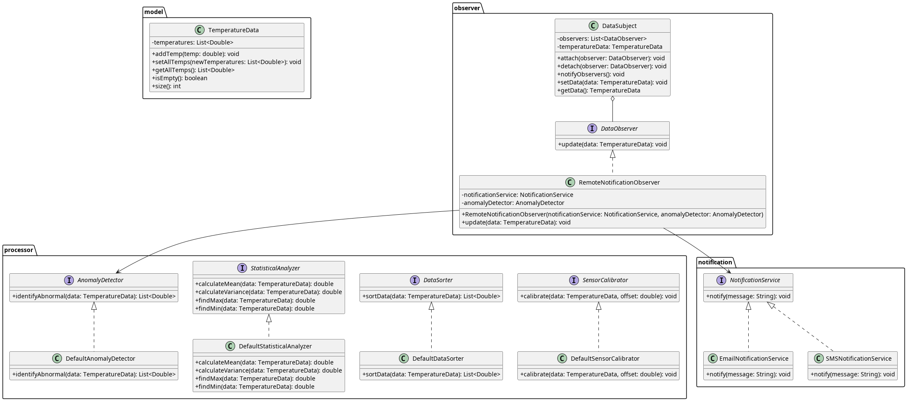

# 软件设计模式与重构 - 第四次作业

## 目录

1. [课堂笔记](#课堂笔记)
2. [练习题内容](#练习题内容)
3. [方案设计](#方案设计)
4. [类图](#类图)
5. [代码实现](#代码实现)
6. [运行结果与分析](#运行结果与分析)

---

## 课堂笔记

### 接口隔离原则 (Interface Segregation Principle, ISP)
- **定义**：不应该强迫客户端依赖它不需要的方法。
- **核心思想**：将臃肿的接口（Fat Interface）拆分为多个职责单一、小的接口。
- **优点**：
    - **降低耦合**：客户端只依赖于它们实际使用的接口。
    - **提高灵活性**：更容易进行扩展和修改。
    - **清晰度**：接口职责更加明确，代码更容易理解和维护。

### 依赖倒置原则 (Dependency Inversion Principle, DIP)
- **定义**：高层模块不应该依赖于低层模块，二者都应该依赖于抽象；抽象不应该依赖于细节，细节应该依赖于抽象。
- **核心思想**：针对接口编程，而不是针对实现编程。

### 依赖注入 (Dependency Injection, DI)
- **定义**：将一个对象所依赖的对象（依赖项）传递给该对象，而不是让该对象自己创建依赖项。
- **常用方式**：构造器注入、Setter注入、接口注入。

### 单一职责原则 (Single Responsibility Principle, SRP)
- **定义**：一个类应该只有一个引起它变化的原因。
- **核心思想**：将不同的职责分离到不同的类中，避免职责过多导致的代码脆弱和维护困难。

---

## 练习题内容

**【需求扩展】**：基于练习2和练习3的内容，系统需求有进一步的考虑与扩展。系统需要对温度数据进行多种处理：异常识别、统计分析、数据排序、传感器标定。

最初设计为包含全部四种处理方法：
1. 考虑现有设计存在的问题，是否遵循接口隔离原则？将大接口 `DataProcessor` 拆分为多个职责单一的小接口；保证结构清晰、低耦合、易扩展。
2. 发生异常，会通过邮件、手机短信等方式进行远程通知；

**【练习要求】**：
- 在练习3的基础上，支持上述需求扩展（1）、（2）；
- 与课堂笔记整合；
- 提供文档包含：课堂笔记、练习题内容、自己的方案、类图、核心代码、运行结果与分析。

---

## 方案设计

### (1) 接口隔离与重构 (ISP应用)
- **发现问题**：原有的 `DataProcessor` 接口包含 `identifyAbnormal`, `calculateStatistics`, `sortData`, `calibrateSensor` 四种不同职责的方法。如果某个客户端只需要统计分析，却被迫依赖标定或排序方法，这显然违背了**接口隔离原则 (ISP)**。
- **重构方案**：废弃 `DataProcessor` 接口，将其拆分为四个精细化、职责单一的接口：
    - `AnomalyDetector`：专门负责异常识别。
    - `StatisticalAnalyzer`：负责均值、方差等统计计算。
    - `DataSorter`：负责数据排序。
    - `SensorCalibrator`：负责传感器数据标定。
- **实现**：系统为这四个接口分别提供了默认实现（如 `DefaultAnomalyDetector`, `DefaultStatisticalAnalyzer` 等），遵循**单一职责原则 (SRP)**。

### (2) 远程通知设计 (DIP + DI 应用)
- **依赖倒置**：定义 `NotificationService` 抽象接口，包含 `notify(String message)` 方法。
- **扩展性**：实现 `EmailNotificationService` 和 `SMSNotificationService` 具体类，以便通过不同方式发送通知。
- **依赖注入**：在原有的观察者模式体系中，新增一个 `RemoteNotificationObserver`，它通过**构造器注入**的方式依赖于 `NotificationService`（用于通知）和 `AnomalyDetector`（用于检测异常）。实现了高层控制逻辑与具体发送方式、异常检测算法之间的解耦。

---

## 类图

下图展示了重构后的系统类图设计。重点展示了 `DataProcessor` 如何被拆分为四个独立接口，以及 `RemoteNotificationObserver` 的依赖注入设计。



---

## 代码实现

### DataProcessor.java (原臃肿接口，已废弃)

```java
package com.designpatterns.processor;

import com.designpatterns.model.TemperatureData;
import java.util.List;

/**
 * 这是一个违反接口隔离原则（ISP）的庞大接口设计示例。
 * 所有的处理职责（异常识别、统计、排序、标定）都被放在了一个接口中。
 * 在第四次作业中，此接口已被拆分为职责单一的多个小接口。
 */
@Deprecated
public interface DataProcessor {
    List<Double> identifyAbnormal(TemperatureData data);
    double[] calculateStatistics(TemperatureData data);
    List<Double> sortData(TemperatureData data);
    void calibrateSensor(TemperatureData data, double offset);
}
```

### AnomalyDetector.java (异常识别接口)

```java
package com.designpatterns.processor;

import com.designpatterns.model.TemperatureData;
import java.util.List;

public interface AnomalyDetector {
    List<Double> identifyAbnormal(TemperatureData data);
}
```

### DefaultAnomalyDetector.java (异常识别具体实现)

```java
package com.designpatterns.processor;

import com.designpatterns.model.TemperatureData;
import java.util.ArrayList;
import java.util.List;

public class DefaultAnomalyDetector implements AnomalyDetector {
    private static final double MIN_NORMAL = 20.0;
    private static final double MAX_NORMAL = 30.0;

    @Override
    public List<Double> identifyAbnormal(TemperatureData data) {
        List<Double> abnormal = new ArrayList<>();
        if (data == null || data.isEmpty()) return abnormal;
        for (double temp : data.getAllTemps()) {
            if (temp < MIN_NORMAL || temp > MAX_NORMAL) {
                abnormal.add(temp);
            }
        }
        return abnormal;
    }
}
```

### StatisticalAnalyzer.java (统计分析接口)

```java
package com.designpatterns.processor;

import com.designpatterns.model.TemperatureData;

public interface StatisticalAnalyzer {
    double calculateMean(TemperatureData data);
    double calculateVariance(TemperatureData data);
    double findMax(TemperatureData data);
    double findMin(TemperatureData data);
}
```

### NotificationService.java (通知服务抽象接口)

```java
package com.designpatterns.notification;

public interface NotificationService {
    void notify(String message);
}
```

### EmailNotificationService.java (邮件通知具体实现)

```java
package com.designpatterns.notification;

public class EmailNotificationService implements NotificationService {
    @Override
    public void notify(String message) {
        System.out.println("【Email 通知】发送邮件: " + message);
    }
}
```

### RemoteNotificationObserver.java (远程通知观察者)

```java
package com.designpatterns.observer;

import com.designpatterns.model.TemperatureData;
import com.designpatterns.notification.NotificationService;
import com.designpatterns.processor.AnomalyDetector;
import java.util.List;

public class RemoteNotificationObserver implements DataObserver {
    private final NotificationService notificationService;
    private final AnomalyDetector anomalyDetector;

    // 依赖注入：针对抽象编程，降低耦合度
    public RemoteNotificationObserver(NotificationService notificationService, AnomalyDetector anomalyDetector) {
        this.notificationService = notificationService;
        this.anomalyDetector = anomalyDetector;
    }

    @Override
    public void update(TemperatureData data) {
        List<Double> anomalies = anomalyDetector.identifyAbnormal(data);
        if (!anomalies.isEmpty()) {
            notificationService.notify("检测到 " + anomalies.size() + " 个温度异常点！异常数据: " + anomalies);
        }
    }
}
```

---

## 运行结果与分析

### 测试环境

| 项目 | 版本 |
|------|------|
| Java | 21+ |
| Gradle | 9.4.1 |
| 测试框架 | JUnit Jupiter |

### 接口隔离与依赖注入测试

```java
@Test
void testAnomalyDetector() {
    AnomalyDetector detector = new DefaultAnomalyDetector();
    List<Double> abnormal = detector.identifyAbnormal(data);
    assertEquals(2, abnormal.size());
    assertTrue(abnormal.contains(10.0));
    assertTrue(abnormal.contains(35.0));
}

@Test
void testRemoteNotification() {
    List<String> messages = new ArrayList<>();
    // Mock 服务验证依赖注入
    NotificationService mockService = messages::add;

    RemoteNotificationObserver observer = new RemoteNotificationObserver(mockService, new DefaultAnomalyDetector());
    observer.update(data);

    assertEquals(1, messages.size());
    assertTrue(messages.get(0).contains("2 个温度异常点"));
}
```

### 运行结果

```text
========== 温度数据采集与分析系统 ==========

显示: [10.0, 50.0, 25.0]
分析: max=50.0, min=10.0, 异常=[10.0, 50.0]
已保存到: temperature_log.txt
【Email 通知】发送邮件: 检测到 2 个温度异常点！异常数据: [10.0, 50.0]

--- 接口隔离原则 (ISP) 处理演示 ---
统计分析: 均值=28.33, 方差=272.22
数据排序: [10.0, 25.0, 50.0]
数据已校准，偏差值: -0.5
标定后重新计算均值: 27.83
```

### 分析

1. **自动触发与异常检测**：系统接收到带有异常值（10.0 和 50.0，超出了正常的20-30范围）的数据后，`DataSubject` 触发了所有的观察者。`RemoteNotificationObserver` 借助依赖注入的 `AnomalyDetector` 准确识别了异常数据。
2. **多渠道解耦通知**：在控制台中打印出了 `【Email 通知】`。由于采用了**依赖注入**与**针对抽象编程**，如果我们想切换为短信通知，只需在组装 `RemoteNotificationObserver` 时将传入的实例从 `EmailNotificationService` 更换为 `SMSNotificationService` 即可，完全不需要修改观察者的内部代码，完美体现了开闭原则和依赖倒置原则。
3. **接口隔离原则的收益**：在下半部分的 `ISP 处理演示` 中，我们分别单独实例化了 `DefaultStatisticalAnalyzer`、`DefaultDataSorter` 和 `DefaultSensorCalibrator` 来独立处理数据。这些具体实现类不再像老版本那样必须实现无关的冗余方法，使用起来更加轻量和清晰，系统耦合度被成功降低。

---

## 总结

本次作业在练习3的基础上进一步重构了系统架构，深入应用了 **接口隔离原则 (ISP)** 与 **依赖倒置原则 (DIP)**。

1. **接口隔离 (ISP)**：彻底废弃了原来庞大的 `DataProcessor`，拆分成了 `AnomalyDetector`、`StatisticalAnalyzer`、`DataSorter` 和 `SensorCalibrator` 多个职责单一的小接口。客户端可以按需依赖，避免了强耦合。
2. **依赖倒置与注入 (DIP & DI)**：在实现远程通知功能时，没有直接依赖具体的邮件发送类，而是抽象出了 `NotificationService` 接口，并在 `RemoteNotificationObserver` 中通过**构造器注入**。这大大增强了系统的可扩展性与灵活性。
3. **多重模式协同**：当前系统已经成功融合了工厂模式（数据源创建）、策略模式（不同分析策略）、观察者模式（事件驱动处理）以及基于原则的依赖注入和接口隔离，展现了良好的面向对象设计思维。
